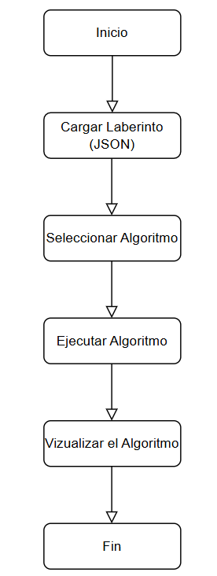

# Manual Técnico de MazeBot

## 1. Introducción
El proyecto MazeBot es un simulador tridimensional de resolución de laberintos, desarrollado como parte del curso de Inteligencia Artificial 1 en la Universidad de San Carlos de Guatemala. Este manual técnico cubre la instalación, la arquitectura del sistema, los algoritmos utilizados y detalles importantes para el desarrollo.

## 2. Requisitos Técnicos
- **Lenguaje de Programación**: JavaScript
- **Bibliotecas Utilizadas**: Three.js
- **Herramientas**: GitHub, GitHub Pages

## 3. Instalación

### 3.1 Requisitos Previos
- Tener instalado un navegador moderno.
- Tener acceso a GitHub para el control de versiones.

### 3.2 Pasos para la Instalación
1. Clonar el repositorio desde GitHub.
2. Abrir el archivo `index.html` en un navegador para iniciar la aplicación.

## 4. Arquitectura del Sistema

### 4.1 Descripción General
El sistema está compuesto por una interfaz web interactiva que permite cargar laberintos dinámicamente a través de archivos JSON. Se utiliza Three.js para la visualización 3D y p5.js para los elementos interactivos.

### 4.2 Diagrama de Flujo
```plaintext
Inicio -> Cargar Laberinto (JSON) -> Inicializar Robot -> Seleccionar Algoritmo de Búsqueda -> Ejecución de Algoritmo -> Visualización del Camino -> Fin
```


### 5. Algoritmos de Búsqueda

En MazeBot se implementaron tres algoritmos de búsqueda: **BFS (Breadth-First Search)**, **Dijkstra** y **A\***. La elección de estos algoritmos se basó en sus características y adecuación para resolver problemas de búsqueda de caminos en laberintos.

#### 5.1 **BFS (Breadth-First Search)**
El algoritmo **BFS** es un algoritmo de búsqueda no informada que explora todos los nodos a la misma distancia del nodo inicial antes de avanzar hacia los nodos más distantes. Este algoritmo fue elegido debido a las siguientes razones:

- **Exploración Óptima en Laberintos Simples**: En laberintos donde todos los movimientos tienen el mismo **esfuerzo** (es decir, todos los pasos requieren el mismo tiempo o energía), BFS garantiza encontrar el camino más corto.
- **Facilidad de Implementación**: Al ser un algoritmo sencillo basado en una estructura de cola, BFS es fácil de implementar y comprender, lo que lo hace ideal para fines educativos y demostrativos.

#### 5.2 **Dijkstra**
**Dijkstra** es un algoritmo de búsqueda informada que encuentra el camino más corto desde un nodo inicial hasta un nodo de destino, teniendo en cuenta el **esfuerzo** de los caminos. Se utilizó Dijkstra por las siguientes razones:

- **Manejo de Esfuerzos Variables**: Dijkstra es especialmente útil cuando los caminos en el laberinto tienen **dificultades** distintas. Por ejemplo, si se quisiera asignar más dificultad o beneficio a ciertos caminos, Dijkstra puede adaptarse para encontrar el camino más eficiente considerando estas diferencias.
- **Versatilidad en Diferentes Entornos**: A diferencia de BFS, Dijkstra puede manejar laberintos más complejos con diferentes **niveles de dificultad** en cada movimiento, proporcionando una solución óptima en escenarios más avanzados.

#### 5.3 **A\*** 
El algoritmo **A\*** es un algoritmo heurístico que busca el camino más corto desde un nodo inicial hasta un nodo de destino, combinando el **esfuerzo** de los caminos con una estimación de la dificultad futura (heurística). La elección de **A\*** se basó en las siguientes razones:

- **Eficiencia en Grandes Espacios de Búsqueda**: A\* es más eficiente que BFS y Dijkstra en términos de tiempo de ejecución en laberintos grandes o complejos debido a su uso de una función heurística que prioriza la expansión de nodos más prometedores.
- **Optimalidad y Velocidad**: A\* es ideal para encontrar soluciones rápidamente en laberintos grandes, ya que minimiza la cantidad de nodos explorados mediante la estimación de la **dificultad** restante. Esto lo hace particularmente útil cuando el tiempo de ejecución es un factor crítico.
