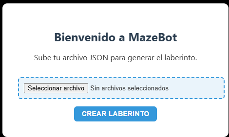

---

### **Manual de Usuario** (Markdown)

# Manual de Usuario de MazeBot

## 1. Introducción
MazeBot es una aplicación web interactiva que simula un robot capaz de resolver laberintos generados dinámicamente. Este manual está diseñado para guiarte a través del uso de la aplicación.

## 2. Requisitos del Sistema
- Navegador web moderno (Chrome, Firefox, etc.)
- Acceso a internet para cargar la aplicación desde GitHub Pages.

## 3. Uso de la Aplicación

### 3.1 Cargar un Laberinto
1. Dirígete a la página web de MazeBot en el siguiente enlace: [Enlace a MazeBot](https://esau-arenas.github.io/IA1_1S2025_P3_G4/).
2. Carga un laberinto en formato JSON desde el menú "Cargar Laberinto".

### 3.2 Seleccionar un Algoritmo de Búsqueda
1. Una vez cargado el laberinto, selecciona uno de los tres algoritmos disponibles: BFS, Dijkstra o A*.
2. Haz clic en **"Ejecutar"** para que el robot comience a buscar el camino.

### 3.3 Visualización y Control
- **Animación**: El robot se moverá paso a paso por el laberinto, mostrando su progreso.
- **Reiniciar**: Al finalizar la simulación, puedes reiniciar la animación para probar otro algoritmo o cargar un nuevo laberinto.

## 4. Solución de Problemas

### 4.1 Problema: El laberinto no se carga correctamente
- **Solución**: Asegúrate de que el archivo JSON esté bien formateado. Verifica la estructura de paredes y puntos de inicio y fin.

### 4.2 Problema: El robot no se mueve
- **Solución**: Verifica si has seleccionado un algoritmo de búsqueda antes de iniciar la simulación.

## 5. Conclusión
MazeBot proporciona una forma visual e interactiva para explorar los principios de la inteligencia artificial mediante la simulación de algoritmos de búsqueda en un entorno tridimensional. ¡Disfruta explorando y aprendiendo!

